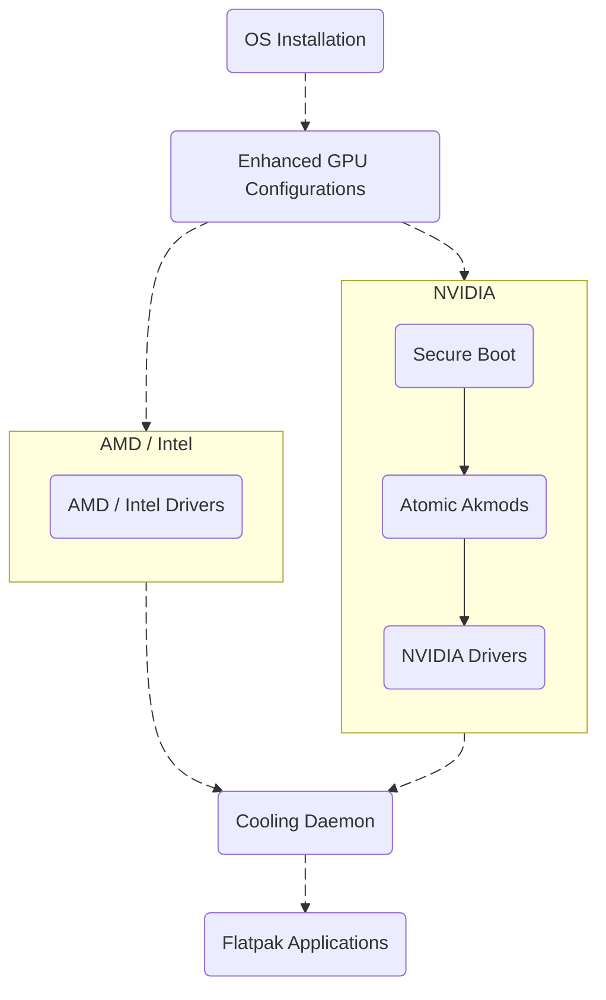

# [Fedora Silverblue](https://fedoraproject.org/atomic-desktops/silverblue/)

- [Atomic OS Concept](#-atomic-os-concept)
- [Driver Integration](#️-driver-integration)
- [Flatpak](#-flatpak)
- [Toolbox](#-toolbox)
- [Setup Guide](#-setup-guide)

## 🔒 [Atomic OS Concept](https://docs.fedoraproject.org/en-US/atomic-desktops/)

The operating system is **read-only** at runtime. This property ensures the base image remains untouched, making the system truly **immutable**.  
Any modification happens by **rebuilding** or **layering** a new image instead of mutating system files in place.  
- **_Benefits_**: Deterministic, reproducible systems with atomic upgrades, instant rollbacks and strong isolation between the base system and user space.  
- **_Trade-offs_**: Low-level changes (e.g. kernel modules, hardware drivers and system packages) require inclusion in the base image and activation via reboot.

For further background, refer to the [Technical Information](https://docs.fedoraproject.org/en-US/atomic-desktops/technical-information/) and [OSTree](https://ostreedev.github.io/ostree/) documentation.

## ⚙️ Driver Integration

**Drivers** that rely on kernel modules must be part of the active OSTree deployment to load correctly at boot. Typical examples include:
- GPU drivers
- Wi-Fi and Network Adapters
- Other low-level hardware drivers

## 📦 [Flatpak](https://flatpak.org/)

A containerized, **application framework** that runs applications in isolated sandboxes.  
Flatpaks install their own runtimes and dependencies in user space (or system-wide), preserving the integrity of the immutable OS.  
Perfect for desktop applications, distributed via [Flathub](https://flathub.org/en), which offers a wide range of software.

## 🧰 [Toolbox](https://docs.fedoraproject.org/en-US/fedora-silverblue/toolbox/)

A containerized, **mutable development environment** that provides a distro-like shell with package manager access.  
Provides a writable container for compiling, packaging or running tooling that shouldn't be installed into the immutable OS.

## 📜 Setup Guide

The setup guide is separated into modular sections.  
Each section builds on the previous one:

- [OS Installation](os-installation.md)
- [Enhanced GPU Configurations](gpu-configs/README.md)
	- [AMD / Intel Drivers](gpu-configs/amd-intel.md)
	- NVIDIA
		- [Secure Boot](secure-boot/README.md)
		- [Atomic Akmods](secure-boot/atomic-akmods.md)
		- [NVIDIA Drivers](gpu-configs/nvidia.md)
- [Cooling Daemon](cooldx/README.md)
- [Flatpak Applications](flatpak/README.md)

High-level workflow of the setup guide:

