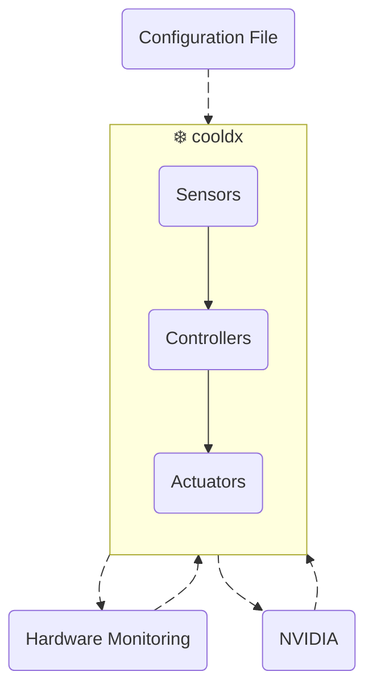

# ❄️ Cooling Daemon eXtended (cooldx)

- [System Design](#-system-design)
- [Terminology](#-terminology)
- [File Summary](#-file-summary)
- [Discovering Hardware Devices](#-discovering-hardware-devices)
	- [Hardware Monitoring via `hwmon`](#-hardware-monitoring-via-hwmon)
	- [NVIDIA GPUs via `nvml`](#-nvidia-gpus-via-nvml)
- [Setup and Operations](#️-setup-and-operations)
	- [Configuration](#️-configuration)
	- [Installation](#-installation)
	- [Managing the Service](#-managing-the-service)
	- [Viewing Logs](#-viewing-logs)
	- [Uninstalling](#-uninstalling)
- [Appendix](#-appendix)
	- [PWM Overview](#-pwm-overview)
	- [Motherboard Fan Headers](#️-motherboard-fan-headers)


## 🚀 System Design

`cooldx` is a lightweight, configuration-driven fan and pump controller.
- Reads temperature sensors from CPU, GPU and AIO coolers.
- Controls Fan and Pump speeds using piecewise-linear temperature curves.
- Applies hysteresis to prevent fan speed oscillation from sensor noise.
- Runs as a `systemd` service for automatic startup and integration with `journald`.

High-level overview:
<div align="center">



</div>
<br>


## 📜 Terminology

| Term | Role |
|------|------|
| Sensors | Provide temperature readings from hardware components (CPU cores, GPU, liquid coolant, etc.) |
| Actuators | Control fan/pump speeds using [PWM](#-pwm-overview) (Pulse Width Modulation), a duty cycle ranging from 0-255 (0% to 100%) |
| Controllers | Define the relationship between sensors and actuators through temperature-to-duty cycle curves.<br>Multiple sensors can drive a single actuator using aggregation methods (`max`,`min`,`avg`) |


## 📂 File Summary

| File | Description |
|------|-------------|
| `cooldx.py` | Main daemon script. Using Python 3 [Standard Library](https://docs.python.org/3/library/index.html) only. No dependencies required. |
| `cooldx-config.json` | Declarative JSON configuration for sensors, controllers and fan curves. |
| `cooldx.service` | `systemd` unit file for automatic startup. |
| `cooldx-install.sh` | Installation and Uninstallation script. |


## 🔍 Discovering Hardware Devices

Hardware sensors and fan/pump controllers are accessed through two different interfaces:

- [`hwmon`](https://docs.kernel.org/hwmon/hwmon-kernel-api.html): Linux kernel subsystem for CPU, motherboard, AIO coolers and NVMe drives.
- [`nvml`](https://developer.nvidia.com/management-library-nvml): NVIDIA Management Library for GPU monitoring and control.  


### 💎 Hardware Monitoring via `hwmon`

Linux exposes hardware monitoring devices through the [`hwmon`](https://docs.kernel.org/hwmon/hwmon-kernel-api.html) subsystem at `/sys/class/hwmon/`.  
Devices appear as `hwmon0`, `hwmon1`, `hwmon2`, etc.  
The numbers **change** between boots. 


1. **Listing Devices**

	List all `hwmon` device names to see which hardware is available:
	```bash
	grep . /sys/class/hwmon/*/name
	```

	Expected output: (Example)
	```
	/sys/class/hwmon/hwmon0/name:acpitz
	/sys/class/hwmon/hwmon1/name:nvme
	/sys/class/hwmon/hwmon2/name:nvme
	/sys/class/hwmon/hwmon3/name:nvme
	/sys/class/hwmon/hwmon4/name:nct6798
	/sys/class/hwmon/hwmon5/name:spd5118
	/sys/class/hwmon/hwmon6/name:spd5118
	/sys/class/hwmon/hwmon7/name:spd5118
	/sys/class/hwmon/hwmon8/name:spd5118
	/sys/class/hwmon/hwmon9/name:kraken2023
	/sys/class/hwmon/hwmon10/name:asus
	/sys/class/hwmon/hwmon11/name:corsairpsu
	/sys/class/hwmon/hwmon12/name:coretemp
	```

	Common device names:
	| Device Name | Hardware | Sensors | Actuators |
	|-------------|----------|---------|-----------|
	| `coretemp` | Intel CPU | Core temperatures |  |
	| `k10temp` | AMD CPU | Core temperatures |  |
	| `nvme` | NVMe SSD | Drive temperatures |  |
	| `kraken2023` | NZXT Kraken AIO | Liquid temperatures, Fan speed | Fan and Pump PWM |
	| `nct6798` | Motherboard Super I/O | Case Fan RPM | Case Fan PWM |
	| `acpitz` | ACPI thermal zone | System temperatures |  |


1. **Exploring Devices**  

	Once the device `name` is identified, use its current `hwmon` path and list all available sensors and actuators.  

	Choose a method:
	
	- Navigate through device files individually:  
		Change the `hwmon*` number to the device being explored.
		1. List all device files:
			```bash
			grep . /sys/class/hwmon/hwmon9/* 2>/dev/null
			```

		1. List only temperature, PWM and fan device files:
			```bash
			grep --color=always . /sys/class/hwmon/hwmon9/{temp*label,temp*input,pwm*enable,pwm[0-9],pwm[0-9][0-9],fan*label,fan*input} 2>/dev/null | sort -u
			```

	- Explore all devices at once:  
		```bash
		echo ""
		pattern="temp*label,temp*input,pwm*enable,pwm[0-9],pwm[0-9][0-9],fan*label,fan*input"
		for device in /sys/class/hwmon/hwmon*/name; do 
			hwmon_path=$(dirname "$device")
			device_name=$(cat "$device")
			echo "=================================================================="
			echo "Device: '$device_name' in '$hwmon_path'"
			echo "=================================================================="
			eval "grep --color=always . "$hwmon_path"/{"$pattern"} 2>/dev/null" | sort -u
			echo ""
		done
		```

	Expected output: (Example for `kraken2023` in `hwmon9`)
	```
	/sys/class/hwmon/hwmon9/fan1_input:2841
	/sys/class/hwmon/hwmon9/fan1_label:Pump speed
	/sys/class/hwmon/hwmon9/fan2_input:689
	/sys/class/hwmon/hwmon9/fan2_label:Fan speed
	/sys/class/hwmon/hwmon9/pwm1_enable:0
	/sys/class/hwmon/hwmon9/pwm1:230
	/sys/class/hwmon/hwmon9/pwm2_enable:0
	/sys/class/hwmon/hwmon9/pwm2:77
	/sys/class/hwmon/hwmon9/temp1_input:26600
	/sys/class/hwmon/hwmon9/temp1_label:Coolant temp
	```


1. **Understanding Device Files**  

	| File | Description | Unit |
	|------|-------------|---------------------|
	| <br>**Temperature Sensors:** |||
	| `temp*_input` | Current temperature reading | Millidegrees Celsius (m°) |
	| `temp*_label` | Sensor name (e.g., "Core 0", "Package") | Text |
	| `temp*_max` | Maximum safe temperature | Millidegrees Celsius (m°) |
	| `temp*_crit` | Critical shutdown temperature | Millidegrees Celsius (m°) |
	| <br>**Speed Sensors:** |||
	| `fan*_input` | Current Fan/Pump speed | RPM |
	| `fan*_label` | Fan/Pump name (e.g., "CHA_FAN1") | Text |
	| <br>**Actuators:** |||
	| `pwm*_enable` | [Control mode](https://www.kernel.org/doc/Documentation/hwmon/nct6775):<br>`0` = Disabled (Set to Max)<br>`1` = Manual<br>`2` = Thermal Cruise<br>`3` = Fan Speed Cruise<br>`4` = Smart Fan III<br>`5` = Smart Fan IV | Integer |
	| `pwm*` | Fan/Pump Duty Cycle <br>0 - 255 (0% to 100%) | Integer |


1. **Identifying Actuators**  

	Device labels typically identify sensors and actuators (e.g. `fan1_label` corresponds to `pwm1_enable` and `pwm1`).  
	If labels are unclear or multiple fans share similar names, test each PWM channel by setting distinct speeds.

	Example using `kraken2023` device in `hwmon9`:
	
	1. Enable manual control:
		```bash
		echo 1 | sudo tee "/sys/class/hwmon/hwmon9/pwm2_enable"
		```

	1. Set different speeds to identify which physical fan responds:
		```bash
		echo  76 | sudo tee "/sys/class/hwmon/hwmon9/pwm2"		# 30%
		echo 128 | sudo tee "/sys/class/hwmon/hwmon9/pwm2"		# 50%
		echo 255 | sudo tee "/sys/class/hwmon/hwmon9/pwm2"		# 100%
		```
<br>

### 🎮 NVIDIA GPUs via `nvml`

NVIDIA GPUs are accessed through [`nvml`](https://developer.nvidia.com/management-library-nvml) (NVIDIA Management Library).  


1. **Verify NVIDIA driver is installed and operational:**
	```bash
	nvidia-smi
	```

	If `nvidia-smi` is not found, install the [NVIDIA Drivers](../gpu-configs/nvidia.md).


1. **List all GPUs:**

	Use Python to enumerate all NVIDIA GPUs and their indices:
	```bash
	python << 'EOF'
	print("\n")

	import ctypes
	
	# Load NVML library
	nvml = ctypes.CDLL("libnvidia-ml.so.1")
	nvml.nvmlInit()
	
	# Get device count
	device_count = ctypes.c_uint()
	nvml.nvmlDeviceGetCount_v2(ctypes.byref(device_count))
	
	print(f"Found {device_count.value} NVIDIA GPU(s):")
	
	# List each GPU
	for i in range(device_count.value):
	    handle = ctypes.c_void_p()
	    nvml.nvmlDeviceGetHandleByIndex_v2(i, ctypes.byref(handle))
	    
	    name = ctypes.create_string_buffer(96)
	    nvml.nvmlDeviceGetName(handle, name, 96)
	    
	    print(f"  - GPU {i}: {name.value.decode('utf-8')}")
	
	nvml.nvmlShutdown()
	EOF
	```

	**Note:** The GPU index (0, 1, 2, etc.) is stable across reboots and matches the index used in `cooldx-config.json`.

	Expected output:
	```
	Found 2 NVIDIA GPU(s):	
	  - GPU 0: NVIDIA GeForce RTX XXXX
	  - GPU 1: NVIDIA GeForce RTX XXXX
	```


1. **Explore GPU properties:**

	Retrieve detailed information for a specific GPU (change `gpu_index` as needed):
	```bash
	python << 'EOF'
	print("\n")

	import ctypes

	class NvmlUtilization(ctypes.Structure):
	    _fields_ = [
	        ("gpu", ctypes.c_uint),
	        ("memory", ctypes.c_uint),
	    ]
	
	gpu_index = 0  # Change this to explore different GPUs
	
	nvml = ctypes.CDLL("libnvidia-ml.so.1")
	nvml.nvmlInit()
	
	handle = ctypes.c_void_p()
	nvml.nvmlDeviceGetHandleByIndex_v2(gpu_index, ctypes.byref(handle))
	
	# GPU name
	name = ctypes.create_string_buffer(96)
	nvml.nvmlDeviceGetName(handle, name, 96)
	print(f"{name.value.decode('utf-8')}:")
	
	# Temperature
	temp = ctypes.c_uint()
	nvml.nvmlDeviceGetTemperature(handle, 0, ctypes.byref(temp))
	print(f"  - Temperature: {temp.value}°C")
	
	# Fan speed (percentage)
	try:
	    fan = ctypes.c_uint()
	    nvml.nvmlDeviceGetFanSpeed_v2(handle, 0, ctypes.byref(fan))
	    print(f"  - Fan Speed: {fan.value}%")
	except:
	    print(f"  - Fan Speed: Not available (non-controllable fan or fanless design)")
	
	# Power usage
	power = ctypes.c_uint()
	nvml.nvmlDeviceGetPowerUsage(handle, ctypes.byref(power))
	print(f"  - Power Usage: {power.value / 1000:.1f}W")
	
	# GPU utilization
	util = NvmlUtilization()
	nvml.nvmlDeviceGetUtilizationRates(handle, ctypes.byref(util))
	print(f"  - GPU Utilization: {util.gpu}%")
	print(f"  - Memory Utilization: {util.memory}%")
	
	nvml.nvmlShutdown()
	EOF
	```

	Expected output:
	```
	NVIDIA GeForce RTX XXXX:
	- Temperature: 28°C
	- Fan Speed: 33%
	- Power Usage: 42.9W
	- GPU Utilization: 18%
	- Memory Utilization: 9%
	```


1. **Understanding GPU properties:**

	| Property | Description | Unit |
	|----------|-------------|------|
	| **Index** | GPU identifier (0, 1, 2, ...) | Integer |
	| **Name** | GPU model name | Text |
	| **Temperature** | Current GPU core temperature | Degrees Celsius (°C) |
	| **Fan Speed** | Current fan speed (if controllable) | Percentage (0-100%) |
	| **Power Usage** | Current power draw | Watts (W) |
	| **GPU Utilization** | GPU compute usage | Percentage (0-100%) |
	| **Memory Utilization** | GPU memory controller usage | Percentage (0-100%) |


1. **Testing fan control:**

	For GPUs with controllable fans, test manual fan control by setting different speeds.  
	Change the `gpu_index` and uncomment the desired `duty_pct` to test:

	```bash
	sudo python << 'EOF'
	print("\n")

	import ctypes
	
	gpu_index = 0  # Change this to the target GPU
	
	nvml = ctypes.CDLL("libnvidia-ml.so.1")
	nvml.nvmlInit()
	
	handle = ctypes.c_void_p()
	nvml.nvmlDeviceGetHandleByIndex_v2(gpu_index, ctypes.byref(handle))
	
	# Set fan speed - uncomment one line to test
	duty_pct = 30   # 30%
	# duty_pct = 50   # 50%
	# duty_pct = 75   # 75%
	# duty_pct = 100  # 100%
	
	try:
	    nvml.nvmlDeviceSetFanSpeed_v2(handle, 0, duty_pct)
	    print(f"Set GPU '{gpu_index}' fan to '{duty_pct}%'")
	except Exception as e:
	    print(f"Fan control not supported: {e}")
	
	nvml.nvmlShutdown()
	EOF
	```

1. **Reset to automatic fan control:**
	```bash
	sudo python << 'EOF'
	print("\n")
	
	import ctypes
	
	gpu_index = 0  # Change this to the target GPU
	
	nvml = ctypes.CDLL("libnvidia-ml.so.1")
	nvml.nvmlInit()
	
	handle = ctypes.c_void_p()
	nvml.nvmlDeviceGetHandleByIndex_v2(gpu_index, ctypes.byref(handle))
	
	nvml.nvmlDeviceSetDefaultFanSpeed_v2(handle, 0)
	print(f"Reset GPU '{gpu_index}' to automatic fan control")
	
	nvml.nvmlShutdown()
	EOF
	```


## 🛠️ Setup and Operations

### ⚙️ Configuration

The [configuration file](cooldx-config.json) defines runtime settings, sensors and controllers.  

**Prerequisites:**  
Before configuring `cooldx`, complete the [Hardware Discovery](#-discovering-hardware-devices) process to identify:
- Available temperature sensors 
- Controllable fans and pumps 

The configuration directly maps discovered hardware into named sensors and controllers.  
Reference the device names, file paths and indices found during discovery.


1. **Runtime configuration options:**

	| Option | Description |
	|--------|-------------|
	| `test_mode` | When `true`, logs actions without writing to hardware. |
	| `verbose_logging` | When `true`, logs all actions. |
	| `poll_interval_s` | Number of seconds between each cycle. |
	| `hysteresis_c` | Minimum temperature change (°C) required to trigger a duty cycle update. |
	| `failsafe_duty_pct` | Duty cycle applied if the sensor or actuator fails. |


1. **Sensors:**

	Each sensor definition maps to a specific hardware device.

	| Parameter | Description |
	|-----------|-------------|
	| <br>**hwmon:** ||
	| `device` | Device name from `/sys/class/hwmon/*/name` (e.g. `coretemp`, `kraken2023`) |
	| `match` | Temperature file pattern match (e.g. `temp1_input`, `temp*_input`) |
	| `aggregate` | Method for combining multiple readings (`max`, `min`, `avg`) |
	| <br>**nvml:** ||
	| `gpu_index` | GPU index from NVML enumeration (e.g. `0`, `1`) |


1. **Controllers:**

	Controllers map actuators (fans/pumps) to sensors and define their respective temperature-to-duty cycle curves.

	| Parameter | Description |
	|-----------|-------------|
	| `actuator` | The PWM channel or GPU fan.<br><br>**hwmon:**<br>`device`: Device name from hwmon<br>`enable`: PWM enable file (e.g. `pwm2_enable`)<br>`pwm`: PWM control file (e.g. `pwm2`)<br><br>**nvml:**<br>`gpu_index`: GPU index<br>`fan_index`: Fan index |
	| `inputs` | List of sensor names to monitor (e.g. `cpu_temp`, `gpu_temp`) |
	| `aggregate` | How to combine multiple sensor readings (`max`, `min`, `avg`) |
	| `curve` | Temperature-to-duty cycle mapping (piecewise linear interpolation) |


1. **Example Configuration structure:**
	```json
	{
		"runtime": {
			"test_mode": false,
			"verbose_logging": true,
			"poll_interval_s": 3,
			"hysteresis_c": 3.0,
			"failsafe_duty_pct": 90
		},
		"sensors": {
			"cpu_temp": {
				"type": "hwmon",
				"device": "coretemp",
				"match": "temp*_input",
				"aggregate": "max"
			},
			"ram_1": {
				"type": "hwmon",
				"device": "spd5118",
				"match": "temp1_input",
				"aggregate": "max"
			},
			"gpu_temp": {
				"type": "nvml",
				"gpu_index": 0
			}
		},
		"controllers": {
			"cpu_aio_fan": {
				"actuator": {
					"type": "hwmon",
					"device": "kraken2023",
					"enable": "pwm2_enable",
					"pwm": "pwm2"
				},
				"inputs": ["cpu_temp","ram_1","gpu_temp"],
				"aggregate": "max",
				"curve": [
					{ "temp_c": 30, "duty_pct": 30 },
					{ "temp_c": 50, "duty_pct": 50 },
					{ "temp_c": 65, "duty_pct": 100 }
				]
			},
			"gpu_fan": {
				"actuator": {
					"type": "nvml",
					"gpu_index": 0,
					"fan_index": 0
				},
				"inputs": ["cpu_temp","ram_1","gpu_temp"],
				"aggregate": "max",
				"curve": [
					{ "temp_c": 30, "duty_pct": 30 },
					{ "temp_c": 50, "duty_pct": 50 },
					{ "temp_c": 65, "duty_pct": 100 }
				]
			}
		}
	}
	```


### 🔥 Installation

Each file is placed in a system directory that follows Linux [Filesystem Hierarchy Standard (FHS)](https://refspecs.linuxfoundation.org/FHS_3.0/fhs/index.html):  
The table below is a summary of the File Directory Locations and Permissions:

| File |  Location | Permissions | Permission Description |
|------|-----------|-------------|------------------------|
| `cooldx.py` | `/usr/local/lib/cooldx/` | `755` (root:root) | Executable by all, writable by root only |
| `cooldx-config.json` | `/etc/cooldx/` | `644` (root:root) | Readable by all, writable by root |
| `cooldx.service` | `/etc/systemd/system/` | `644` (root:root) | Readable by all, writable by root |


1. Make the [installation script](cooldx-install.sh) executable:
	```bash
	chmod +x cooldx-install.sh
	```

1. Execute the installation script:
	```bash
	sudo ./cooldx-install.sh
	```


### 🧮 Managing the Service

`cooldx` runs as a `systemd` service, providing automatic startup and integration with the system journal.

| Command | Description |
|:--------|:------------|
| `systemctl status cooldx` | Check service status |
| `sudo systemctl start cooldx` | Start the service |
| `sudo systemctl stop cooldx` | Stop the service |
| `sudo systemctl restart cooldx` | Restart the service |
| `sudo systemctl enable cooldx` | Enable automatic startup at boot |
| `sudo systemctl disable cooldx` | Disable automatic startup |
| `systemctl cat cooldx --no-pager` | View the service file |


### 👀 Viewing Logs

`systemd` captures all output from `cooldx` and stores it in the system journal.  
Use `journalctl` to view logs, troubleshoot issues and verify operation.


- **View logs for the current boot:**
	```bash
	journalctl -u cooldx -b --no-pager
	```
	
- **View logs for each boot:**
	```bash
	journalctl -u cooldx --no-pager
	```

- **Follow logs in real-time:**
	```bash
	journalctl -u cooldx -f
	```


### 🪓 Uninstalling

Using the installation script:
```bash
sudo ./cooldx-install.sh --uninstall
```


## 📖 Appendix


### 🌀 PWM Overview

PWM (Pulse Width Modulation) is the method used to control fan and pump speeds.  
Instead of varying the voltage, the signal rapidly switches between fully **ON** and fully **OFF**.  
The **duty cycle** determines how much time the signal spends in the **ON** state.  
The Linux `hwmon` subsystem uses an integer range of **0-255** for PWM values.

| Duty Cycle | PWM Value | Effect |
|------------|-----------|--------|
| 0% | `0` | Fan off (or lowest speed) |
| 50% | `127` | Half speed |
| 100% | `255` | Full speed |


### 🖥️ Motherboard Fan Headers

Most motherboards use a **Super I/O chip** to control case fan headers (CHA_FAN1, CHA_FAN2, etc.)  
These chips are manufactured by Nuvoton (NCT series), ITE (IT87 series) or Fintek (F71 series).

By default, Linux may not load the kernel driver for the Super I/O chip, meaning:
- Case fan speeds won't appear in `/sys/class/hwmon/`
- Software fan control (like `cooldx`) cannot manage motherboard fan headers
- Fan curves are limited to UEFI/BIOS only configuration

The `nct6775` kernel module supports the Nuvoton Super I/O chip family.
The module is named after the first chip it supported, but it handles all chips in the family:

| Chip | Motherboard Era | Notes |
|------|-----------------|-------|
| NCT6775 | ~2011 | Original chip, driver named after it |
| NCT6776 | ~2012 | |
| NCT6779 | ~2013 | |
| ... | ... | |
| NCT6797 | ~2019 | |
| NCT6798 | ~2020 | Intel 400/500 series boards |
| NCT6799 | ~2021 | Intel 600/700 series boards |
| ... | ... | |


#### Loading the Kernel Module

1. **Check if a Super I/O chip is already detected:**
	```bash
	grep . /sys/class/hwmon/*/name | grep -iE "nct|it87|f71"
	```

	If output is returned, the driver is already loaded.  
	Refer to [Hardware Monitoring via `hwmon`](#-hardware-monitoring-via-hwmon) for details on discovering sensors and actuators.

1. **Load the nct6775 kernel module:**
	```bash
	sudo modprobe nct6775
	```

	After loading, verify the device appears:
	```bash
	grep . /sys/class/hwmon/*/name | grep -i nct
	```

1. **Make the module load automatically on boot:**

	Create a module configuration file:
	```bash
	echo "nct6775" | sudo tee /etc/modules-load.d/nct6775.conf
	```

	The module is loaded automatically by the `systemd-modules-load.service`.  
	It reads configuration files from `/etc/modules-load.d/` during boot.

	View the service file:
	```bash
	systemctl cat systemd-modules-load --no-pager
	```

	View the service status:
	```bash
	systemctl status systemd-modules-load.service
	```