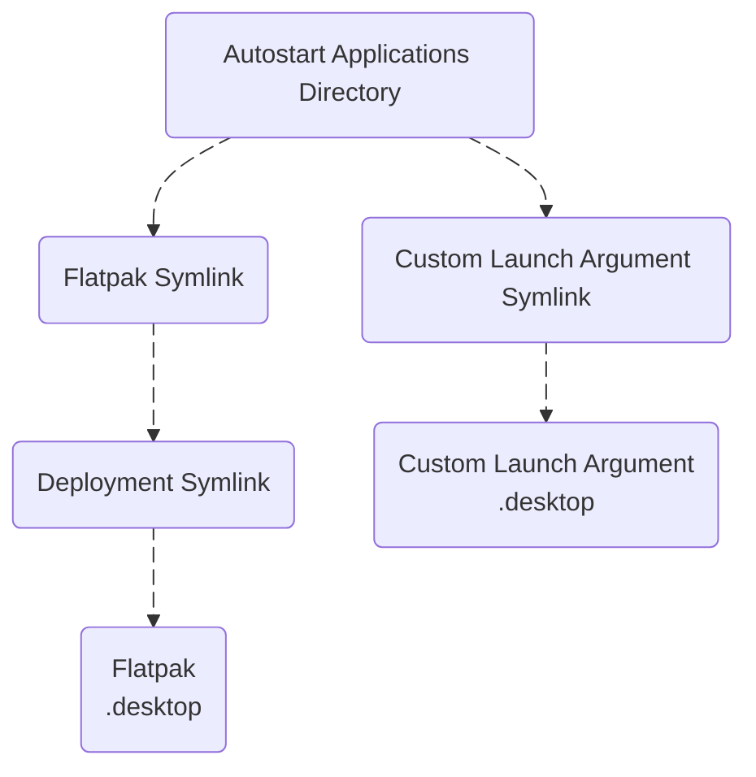

# 📦 [Flatpak](https://flatpak.org/)

- [General Flatpak Commands](#-general-flatpak-commands)
- [Enable Flathub](#-enable-flathub)
- [Install Applications](#-install-applications)
	- [Single Installation](#-single-installation)
	- [Batch Installation](#-batch-installation)
- [Custom Launch Arguments](#️-custom-launch-arguments)
- [Autostart Applications](#-autostart-applications)
	- [Chaining Symlinks](#-chaining-symlinks)


## 🧮 General Flatpak Commands

| Command | Description |
|:--------|:------------|
| <br>**Inventory:** ||
| `flatpak list` | List all installed applications |
| `flatpak update` | Update all applications |
| `flatpak repair` | Repair all applications |
| <br>**Deployment:** ||
| `flatpak search <app>` | Search for an application |
| `flatpak install <app-id>` | Install an application |
| `flatpak run <app-id>` | Launch an application |
| `flatpak kill <app-id>` | Stop a running application |
| <br>**Sandbox Policy** (Use [Flatseal](https://flathub.org/en/apps/com.github.tchx84.Flatseal)) ||
| `flatpak override --user --filesystem=<path> <app-id>` | Filesystem access override |
| `flatpak override --user --show <app-id>` | Show active user overrides |
| `flatpak override --user --reset <app-id>` | Reset all overrides |
| <br>**Diagnostics:** ||
| `flatpak info <app-id>` | Show application details |
| `flatpak info --show-permissions <app-id>` | Show sandbox permissions |
| `flatpak info --show-location <app-id>` | Show install location |


## 📚 Enable Flathub

[Flathub](https://flathub.org/en) is the primary source for Flatpak applications.  
On Fedora Silverblue, Flathub is pre-configured but **disabled by default**.

1. **Check the current state of configured remotes:**
	```bash
	flatpak remotes --show-details
	```

1. **Enable the existing Flathub remote:**
	```bash
	sudo flatpak remote-modify --enable flathub
	```

1. **If Flathub is not listed, add it manually:**
	```bash
	sudo flatpak remote-add --if-not-exists flathub https://dl.flathub.org/repo/flathub.flatpakrepo
	```

1. **Update existing Flatpak applications:**
	```bash
	flatpak update
	```


## 🔥 Install Applications

### 🦴 Single Installation

1. **Search for an application:** 
	```bash
	flatpak search <app>
	```
	Expected output: (e.g. Monero)

	| Name | Description | Application ID | Version | Branch | Remotes |
	|------|-------------|----------------|---------|--------|---------|
	| Monero GUI | Monero: the secure, private, untraceable cryptocurrency | org.getmonero.Monero | 0.18.4.5 | stable | flathub |

1. **Install an application:** 
	```bash
	flatpak install flathub <app-id>
	```

### 🥩 Batch Installation

1. **Batch install from a list:**  
	Maintain a [list](flatpak-app-list.md) of preferred applications using the following format:
	```markdown
	- Application Name: Application ID
	```

	Make the [installation script](flatpak-app-install.sh) executable:
	```bash
	chmod +x flatpak-app-install.sh
	```

	Install all applications listed in the file:
	```bash
	"./flatpak-app-install.sh" "./flatpak-app-list.md"
	```


## ⚙️ Custom Launch Arguments

To apply custom launch arguments on every start, override the `Exec` entry in a user-local copy of the `.desktop` file.  
This leaves the original file unchanged and Flatpak updates will not overwrite the copy in `~/.local/share/applications/`.

1. **Copy the `.desktop` file:**
	```bash
	cp /var/lib/flatpak/exports/share/applications/<app-id>.desktop \
		~/.local/share/applications/
	```

1. **Append arguments to the `Exec` line:**  

	Before:
	```ini
	Exec=/usr/bin/flatpak run ... --command=<app-id> ...
	```

	After:
	```ini
	Exec=/usr/bin/flatpak run ... --command=<app-id> --custom-arg=custom-value ...
	```

	| Application | Custom Argument |
	|-------------|-----------------|
	| Bitcoin Core | `--datadir=/var/mnt/external/storage/bitcoin` |

1. **Test the launch command (`Exec`) in the terminal:**

	```bash
	/usr/bin/flatpak run ... --command=<app-id> --custom-arg=custom-value ...
	```

1. **Reload the desktop database:**

	```bash
	update-desktop-database ~/.local/share/applications/
	```


## 🚀 Autostart Applications

At login, applications listed in `~/.config/autostart/` are launched automatically.  
[Symbolic links](https://fedoraproject.org/wiki/PackagingDrafts/Symlinks) are used to ensure Flatpak updates are reflected automatically.

1. **Ensure the directory exists:**
	```bash
	mkdir -p ~/.config/autostart/
	```

1. **Create a symlink in the autostart folder to the flatpak `.desktop` file:**
	- **Flatpak**  
		Please note this action will result in [chaining symlinks](#-chaining-symlinks).
		```bash
		ln -s /var/lib/flatpak/exports/share/applications/<app-id>.desktop \
			~/.config/autostart/<app-id>.desktop
		```

	- **Custom Launch Arguments**
		```bash
		ln -s ~/.local/share/applications/<app-id>.desktop \
			~/.config/autostart/<app-id>.desktop
		```

1. **Verify:**
	```bash
	ls -la ~/.config/autostart/
	```


### 🔗 Chaining Symlinks

Flatpak maintains a chained symlink for each application's `.desktop` file.

| Scope | Location |
|:-----:|----------|
| Flatpak Symlink | `/var/lib/flatpak/exports/share/applications/<app-id>.desktop` | 
| Deployment Symlink | `/var/lib/flatpak/app/<app-id>/`<b>`current`</b>`/`<b>`active`</b>`/export/share/applications` |
| `.desktop` File | `/var/lib/flatpak/app/<app-id>/<arch>/<branch>/<commit-hash>/export/share/applications` |

<br>
<div align="center">



<div>