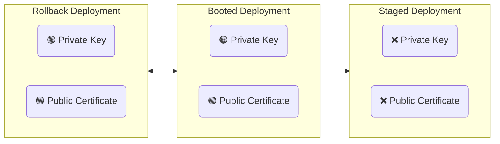
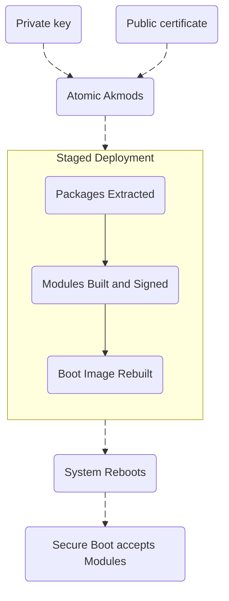

# ⚛ Atomic Akmods

`atomic-akmods` is a local RPM package that layers the private key and public certificate into the OSTree staged deployment.  
This enables `akmods` to sign kernel modules during `rpm-ostree` transactions.  

- [Prerequisites](#️-prerequisites)
- [Problem Statement](#-problem-statement)
- [Solution](#-solution)
- [Installing `atomic-akmods`](#-installing-atomic-akmods)
- [Manual Installation (Optional)](#️-manual-installation-optional)


## ⚠️ Prerequisites
The private key and public certificate must already be generated and enrolled into the MOK database before proceeding.  
Follow the [Secure Boot](README.md) section for more information.


## 🧱 Problem Statement

The core failure path during [staged deployments](https://ostreedev.github.io/ostree/deployment/#staged-deployments):

1. `rpm-ostree` composes a new staged deployment for the next boot.
1. The private key and public certificate remain on the host filesystem and are absent from the staged deployment.
1. `akmods` executes in the staged deployment and builds the modules, but **cannot** sign them.
1. Secure Boot rejects the unsigned modules.


Deployment state snapshot during the `rpm-ostree` transaction:
<div align="center">




</div>
<br>

Modules are signed **only** at build time within the `staged` deployment.  
Keys present in a `booted` or `rollback` deployment cannot retroactively sign modules.

Review the private key and public certificate presence in all known deployments (`staged`, `booted` and `rollback`):

```bash
sudo rpm-ostree status --json | jq -r '.deployments[] | [.staged, .booted, .checksum] | @tsv' | \
while IFS=$'\t' read -r STAGED BOOTED CHECKSUM; do
	echo ""
	echo "==================================================================================================="
	echo "Staged=${STAGED} | Booted=${BOOTED} | ${CHECKSUM}"
	echo "==================================================================================================="
	DEPLOY_DIR=$(find /sysroot/ostree/deploy/fedora/deploy -maxdepth 1 -type d -name "${CHECKSUM}.*" | head -n1)
	if [[ -z "${DEPLOY_DIR}" ]]; then
		echo "Deployment directory not found for checksum: ${CHECKSUM}"
		continue
	fi

	PUBLIC_DIR="${DEPLOY_DIR}/etc/pki/akmods/certs"
	PRIVATE_DIR="${DEPLOY_DIR}/etc/pki/akmods/private"

	PUBLIC_FILES=$(sudo find "${PUBLIC_DIR}" -maxdepth 1 -type f 2>/dev/null | sort || true)
	if [[ -n "${PUBLIC_FILES}" ]]; then
		echo "${PUBLIC_FILES}" | sed "s#^${DEPLOY_DIR}/##"
	else
		echo "No public keys found."
	fi

	PRIVATE_FILES=$(sudo find "${PRIVATE_DIR}" -maxdepth 1 -type f 2>/dev/null | sort || true)
	if [[ -n "${PRIVATE_FILES}" ]]; then
		echo "${PRIVATE_FILES}" | sed "s#^${DEPLOY_DIR}/##"
	else
		echo "No private keys found."
	fi

done
```


## 🎯 Solution

- `atomic-akmods` packages the private key and public certificate as a local RPM package.
- `rpm-ostree` extracts all packages (local and layered) before running `%post` scripts.
- The private key and public certificates are present in the staged deployment when `akmods` signs modules.
- This behavior persists automatically across kernel updates.

High-level overview:
<div align="center">



</div>
<br>


## 🔥 Installing `atomic-akmods`

1. **Make the [installation script](atomic-akmods-install.sh) executable:**
	```bash
	chmod +x atomic-akmods-install.sh
	```

1. **Execute the installation script:**
	```bash
	sudo ./atomic-akmods-install.sh
	```


## 🛠️ Manual Installation (Optional)
This section is **optional**. It simply mimics the workflow in the [installation script](atomic-akmods-install.sh).

Intended usage:
- Educational purposes
- Inspect, customise and troubleshoot the RPM build-and-layer workflow


### On the host

1. **Create a build directory and initialise the RPM layout:**
	```bash
	BUILD_DIR="$HOME/.atomic-akmods-build"
	mkdir -p "${BUILD_DIR}"/{SOURCES,SPECS,BUILD,RPMS,SRPMS}
	```

1. **Copy the signing keys into `SOURCES` and change ownership permissions:**
	```bash
	sudo cp /etc/pki/akmods/certs/public_key.der "${BUILD_DIR}/SOURCES/public_key.der"
	sudo cp /etc/pki/akmods/private/private_key.priv "${BUILD_DIR}/SOURCES/private_key.priv"
	sudo chmod 0400 "${BUILD_DIR}/SOURCES/public_key.der" "${BUILD_DIR}/SOURCES/private_key.priv"
	sudo chown -R "$USER:$USER" "${BUILD_DIR}"
	```

1. **Copy the RPM [specification file](atomic-akmods.spec) into the build directory:**
	```bash
	cp "/path/to/atomic-akmods.spec" "${BUILD_DIR}/SPECS/"
	```	


### Inside the toolbox

1. **Create a toolbox container:**
	```bash
	toolbox create --container atomic-akmods-builder
	```

1. **Enter the toolbox container:**
	```bash
	toolbox enter atomic-akmods-builder
	```

1. **Install RPM build tools:**
	```bash
	sudo dnf install -y rpmdevtools
	```

1. **Build the `atomic-akmods` RPM from the specification file:**
	```bash
	BUILD_DIR="$HOME/.atomic-akmods-build"
	rpmbuild --define "_topdir ${BUILD_DIR}" -bb "${BUILD_DIR}/SPECS/atomic-akmods.spec"
	```

1. **Exit the toolbox:**
	```bash
	exit
	```

1. **Remove the toolbox container:**
	```bash
	toolbox rm --force atomic-akmods-builder
	```


### Back on the host

1. **Extract the path to the `atomic-akmods` RPM:**
	```bash
	RPM_PATH=$(find "${BUILD_DIR}/RPMS" -name "atomic-akmods-*.noarch.rpm" | head -1)
	```

1. **Layer the `atomic-akmods` RPM:**
	```bash
	sudo rpm-ostree install "${RPM_PATH}"
	```

1. **Remove the temporary build directory:**
	```bash
	rm -rf "${BUILD_DIR}"
	```